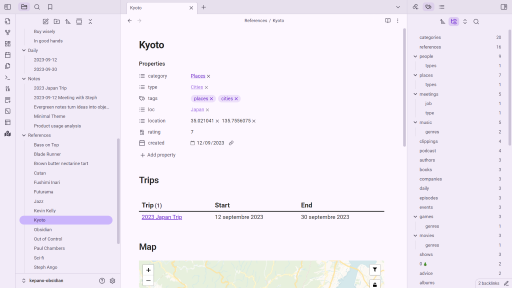

# Obsidian Material 3 theme

This repository hosts a [Material 3](https://m3.material.io/) theme for the [Obsidian](https://obsidian.md/) note-taking tool.

*Due to limitations, this theme does not support dynamic color on Android.* Therefore, the color schemes of this theme were generated based on Obsidian's brand colors.

## Manual installation
1. Download `manifest.json` and `theme.css` for the [latest release](https://github.com/HarmfulBreeze/obsidian-material-3-theme/releases/latest).
2. Using your system's file explorer, create the directory `.obsidian/themes/Material 3` at the root of your vault.
3. Paste `manifest.json` and `theme.css` in this directory.
4. In Obsidian, select "Material 3" in the list of installed themes.

